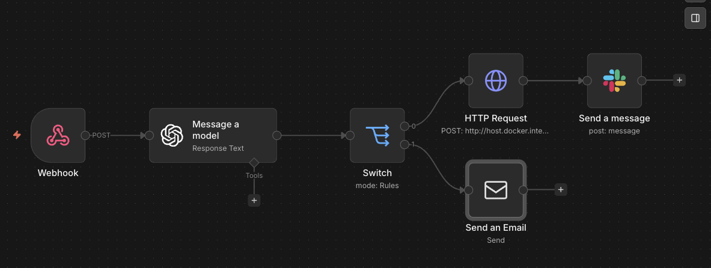
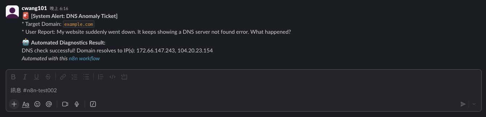

# 🚀 L1 Support Automation System (n8n + TypeScript)

An enterprise-grade, automated L1 support ticket routing system built with **n8n**, **OpenAI**, and a custom **TypeScript Microservice**.

## 📸 Visual Demo

**Automated n8n Workflow:**


**Slack Alert Integration:**


## 📌 Project Overview
This Proof of Concept (PoC) aims to reduce manual triage time for support teams by automatically analyzing incoming tickets, diagnosing network issues, and routing them to the appropriate channels.

### ✨ Key Features
*   **LLM Semantic Routing:** Uses OpenAI (`gpt-4o-mini`) to analyze natural language user messages and strictly classify them into predefined categories (`DNS_ISSUE`, `BILLING_ISSUE`).
*   **Custom Network Microservice:** A strictly typed Node.js/Express service that performs real-time DNS A-Record lookups.
*   **Multi-Channel Alerting:** 
    *   Routes critical infrastructure alerts to **Slack** via OAuth2.
    *   Escalates billing queries to human agents via **SMTP Email**.
*   **Containerized Infrastructure:** Fully deployed using Docker, ensuring environment consistency and zero local dependency conflicts.

## 🛠️ Tech Stack
*   **Workflow Engine:** n8n
*   **AI/LLM:** OpenAI API
*   **Microservice:** Node.js, Express, TypeScript
*   **Infrastructure:** Docker, Docker Compose
*   **Integrations:** Slack API (OAuth2), Google SMTP

## ⚙️ How to Run Locally

1. Clone the repository:
```bash
git clone [https://github.com/Francisco1116/L1-support-automation-poc.git](https://github.com/Francisco1116/L1-support-automation-poc.git)
cd n8n-l1-automation
```
2. Start the n8n instance and local microservice:
```bash
npm install
npx tsx server.ts
docker compose up -d
```
3. Import the `workflow.json` into your local n8n instance (`http://localhost:5678`).
